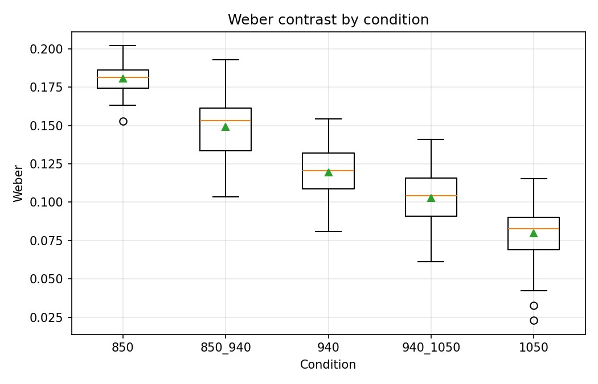
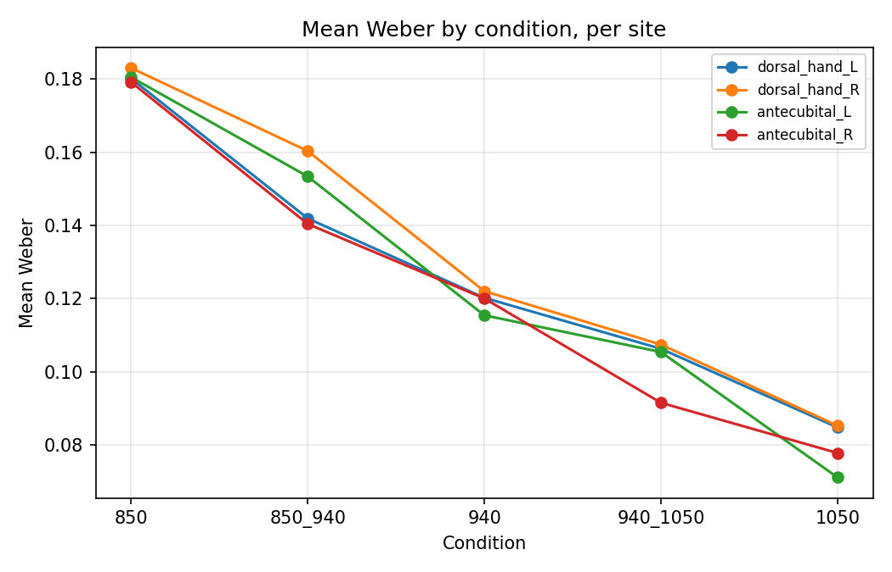
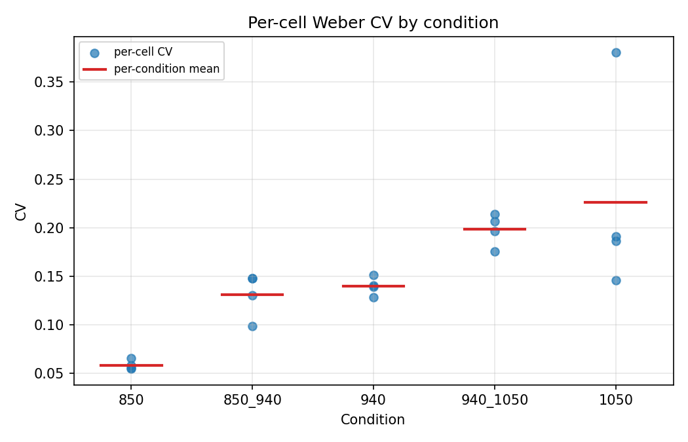

# Post-Generation Validation Report

- Input: `generator/output/synthetic_dataset.csv`
- Seed: `42`
- Rows: `240`

## Metric coherence

- Status: **PASS**
- Tolerance: `1e-09`
- Max |weber residual|: `1.94e-16`
- Max |michelson residual|: `1.53e-16`

## T1 — Cell counts (site × condition)

| site | 850 | 850_940 | 940 | 940_1050 | 1050 |
| --- | --- | --- | --- | --- | --- |
| dorsal_hand_L | 12 | 12 | 12 | 12 | 12 |
| dorsal_hand_R | 12 | 12 | 12 | 12 | 12 |
| antecubital_L | 12 | 12 | 12 | 12 | 12 |
| antecubital_R | 12 | 12 | 12 | 12 | 12 |

## T2 — Condition summary

| condition | mean_weber | sd_weber | cv_weber | mean_michelson |
| --- | --- | --- | --- | --- |
| 850 | 0.180673 | 0.010326 | 0.057151 | 0.099342 |
| 850_940 | 0.148986 | 0.020866 | 0.140051 | 0.080623 |
| 940 | 0.119426 | 0.016339 | 0.136816 | 0.063583 |
| 940_1050 | 0.102672 | 0.020751 | 0.202110 | 0.054237 |
| 1050 | 0.079761 | 0.018776 | 0.235402 | 0.041634 |

## T3 — Site × condition summary

| site | condition | mean_weber | sd_weber | cv_weber |
| --- | --- | --- | --- | --- |
| dorsal_hand_L | 850 | 0.180121 | 0.009786 | 0.054331 |
| dorsal_hand_L | 850_940 | 0.141897 | 0.020991 | 0.147928 |
| dorsal_hand_L | 940 | 0.120207 | 0.015380 | 0.127944 |
| dorsal_hand_L | 940_1050 | 0.106293 | 0.020900 | 0.196629 |
| dorsal_hand_L | 1050 | 0.084802 | 0.016184 | 0.190840 |
| dorsal_hand_R | 850 | 0.182998 | 0.011965 | 0.065382 |
| dorsal_hand_R | 850_940 | 0.160306 | 0.023664 | 0.147619 |
| dorsal_hand_R | 940 | 0.122021 | 0.016983 | 0.139181 |
| dorsal_hand_R | 940_1050 | 0.107448 | 0.018824 | 0.175193 |
| dorsal_hand_R | 1050 | 0.085276 | 0.012450 | 0.145995 |
| antecubital_L | 850 | 0.180464 | 0.010460 | 0.057962 |
| antecubital_L | 850_940 | 0.153356 | 0.015133 | 0.098678 |
| antecubital_L | 940 | 0.115438 | 0.016196 | 0.140297 |
| antecubital_L | 940_1050 | 0.105405 | 0.022535 | 0.213799 |
| antecubital_L | 1050 | 0.071147 | 0.027072 | 0.380509 |
| antecubital_R | 850 | 0.179110 | 0.009914 | 0.055351 |
| antecubital_R | 850_940 | 0.140385 | 0.018289 | 0.130280 |
| antecubital_R | 940 | 0.120036 | 0.018102 | 0.150804 |
| antecubital_R | 940_1050 | 0.091541 | 0.018930 | 0.206792 |
| antecubital_R | 1050 | 0.077819 | 0.014509 | 0.186447 |

## Plots

